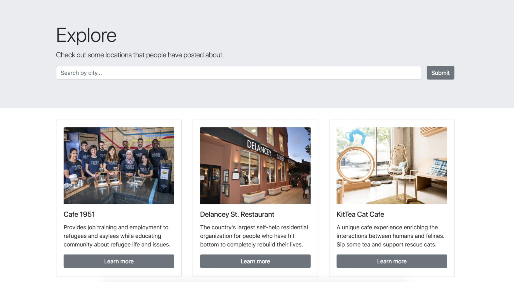

# Social Impact Experience

## Creating a more meaningful traveling experience and bringing awareness to social enterprises.

A social enterprise is a hybrid of a non-profit/NGO and private. A self-sustaining business model that’s mission driven.

Ex.) Delancy St Restaurant in SF, gives a second chance to previous inmates, trains them the skills in food industry, Yangon Bakehouse in Yangon, Myanmar, give women living in poverty a chance to be trained in service industry.

Collaborated with Justin Chau, pair-programmed building end-to-end.

Technologies: 
* Front-End: ReactJS
* Back-End: ExpressJS, PostgreSQL
* Bcrypt & JWT for authentication
* Google Maps API for geolocation

The project is still work in progress.

<kbd></kbd>
<kbd></kbd>

Video Demo
https://youtu.be/57L2UCBL8z0